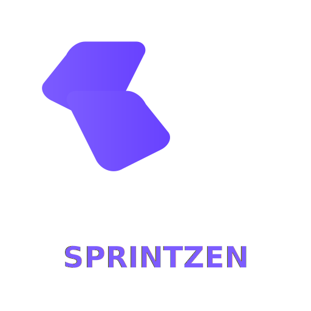

# SPRINTZEN 🌀

A modern full-stack **Agile Scrum Estimation** web app — Planning Poker, live Kanban,
shared notes, and timeline analytics for high-performing software teams.

> Inspired by Jira, Linear & ClickUp. Dark-mode-first, glassmorphism UI.

---

## ✨ Features

- 🔐 **Auth** — JWT login/signup with role-based access (`Admin`, `TeamLeader`, `TeamMember`)
- 📊 **Dashboard** — active projects, sprint progress, team activity, notifications
- 🎯 **Scrum Estimation Board** — sessions with requirements, features, risks, complexity
- 🃏 **Planning Poker** — Fibonacci cards (1, 2, 3, 5, 8, 13, 21), hidden votes, reveal together
- ⚡ **Real-time** — live Kanban, shared notes, activity feed & presence via **Socket.io**
- 📈 **Timeline Analytics** — complexity score, workload, risk level, recommended sprint length, best-team suggestion

---

## 🧱 Tech Stack

| Layer        | Tech                                  |
|--------------|---------------------------------------|
| Frontend     | React 18 + Vite (JavaScript)          |
| Styling      | TailwindCSS (CDN) + custom glass CSS  |
| Backend      | Node.js + Express.js                  |
| Database     | MongoDB + Mongoose                    |
| Realtime     | Socket.io                             |
| Auth         | JWT + bcrypt                          |

---

## 📁 Project Structure

```
sprinzen/
├── backend/
│   ├── src/
│   │   ├── config/        # db connection
│   │   ├── middleware/    # auth, role guards
│   │   ├── models/        # mongoose schemas
│   │   ├── routes/        # REST endpoints
│   │   ├── sockets/       # socket.io handlers
│   │   └── utils/         # analytics helpers
│   ├── server.js
│   ├── package.json
│   └── .env.example
└── frontend/
    ├── src/
    │   ├── api/           # axios client
    │   ├── components/    # reusable UI
    │   ├── context/       # Auth & Socket providers
    │   ├── pages/         # routed pages
    │   ├── App.jsx
    │   └── main.jsx
    ├── index.html
    ├── vite.config.js
    ├── package.json
    └── .env.example
```

---

## 🚀 Getting Started

### 1. Clone & install

```bash
git clone <your-repo-url> sprinzen
cd sprinzen
```

### 2. Backend

```bash
cd backend
cp .env.example .env
# edit .env: set MONGO_URI and JWT_SECRET
npm install
npm run dev
```

Backend runs on `http://localhost:5000`.

### 3. Frontend

In a second terminal:

```bash
cd frontend
cp .env.example .env
npm install
npm run dev
```

Frontend runs on `http://localhost:5173`.

---

## 🔑 Environment Variables

### `backend/.env`
```
PORT=5000
MONGO_URI=mongodb://localhost:27017/sprinzen
JWT_SECRET=replace-me-with-a-long-random-string
CLIENT_ORIGIN=http://localhost:5173
```

### `frontend/.env`
```
VITE_API_URL=http://localhost:5000/api
VITE_SOCKET_URL=http://localhost:5000
```

---

## 📡 REST API (summary)

| Method | Endpoint                       | Description                         |
|--------|--------------------------------|-------------------------------------|
| POST   | `/api/auth/signup`             | Create account                      |
| POST   | `/api/auth/login`              | Login → JWT                         |
| GET    | `/api/auth/me`                 | Current user                        |
| GET    | `/api/projects`                | List projects                       |
| POST   | `/api/projects`                | Create project (Leader/Admin)       |
| GET    | `/api/sessions/:id`            | Get estimation session              |
| POST   | `/api/sessions`                | Create session (Leader/Admin)       |
| POST   | `/api/sessions/:id/vote`       | Cast hidden vote                    |
| POST   | `/api/sessions/:id/reveal`     | Reveal votes                        |
| GET    | `/api/analytics/:projectId`    | Timeline analytics                  |

---

## 🔌 Socket.io Events

| Event                | Payload                          | Direction       |
|----------------------|----------------------------------|-----------------|
| `session:join`       | `{ sessionId, user }`            | client → server |
| `session:presence`   | `{ users: [...] }`               | server → client |
| `session:vote`       | `{ sessionId, value }`           | client → server |
| `session:reveal`     | `{ votes }`                      | server → client |
| `kanban:update`      | `{ projectId, columns }`         | both            |
| `notes:update`       | `{ sessionId, content }`         | both            |
| `activity:new`       | `{ message, user, at }`          | server → client |

---

## 🧑‍💻 Roles

- **Admin** — manage all teams, projects & users
- **TeamLeader** — create projects & estimation sessions, lock estimates
- **TeamMember** — join sessions, vote, edit shared notes

---

## 📦 Deploy

- **Backend:** Render / Railway / Fly.io / any Node host with MongoDB
- **Frontend:** Vercel / Netlify / Cloudflare Pages (set `VITE_API_URL`)
- Make sure to allow your frontend origin in `CLIENT_ORIGIN`.

---

## 📝 License

MIT — go build great sprints. 🚀
